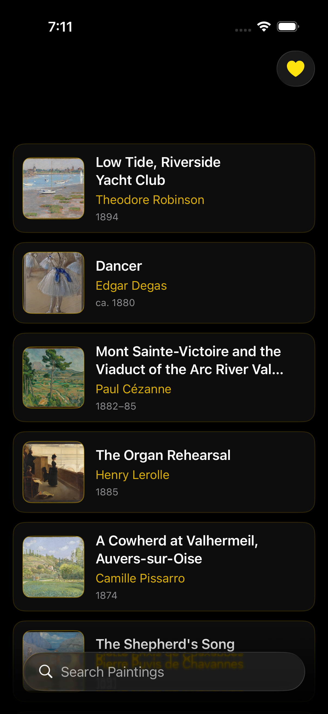
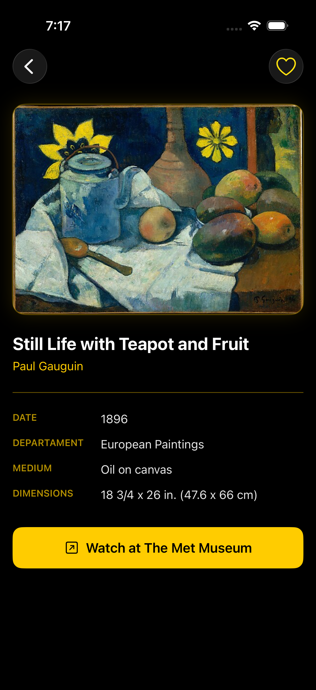
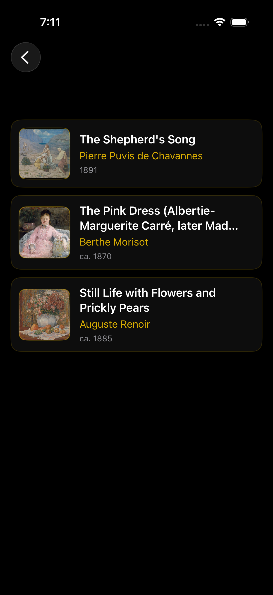

# RijksNav — Met Museum Navigation App

A SwiftUI iOS app that allows visitors to explore and navigate the collection of **The Metropolitan Museum of Art** using their public API.

---

## 📱 Features

- **Browse Collection** — Explore impressionist and other artworks from The Met's collection
- **Search** — Search for specific artworks or artists
- **Artwork Detail** — View high-resolution images, artist info, date, origin, medium, and dimensions
- **Favorites** — Save artworks to a personal favorites list (persisted locally with UserDefaults)
- **Link to Met** — Open any artwork directly on The Met Museum's website

---

## 🎨 Design

Dark and elegant UI with a gold accent color scheme, designed to reflect the prestige of a world-class museum experience.

---

## 🛠 Tech Stack

- **SwiftUI** — Declarative UI framework
- **Swift Concurrency** — `async/await` and `TaskGroup` for parallel API calls
- **MVVM Architecture** — `ObservableObject` + `@Published` for reactive data flow
- **AsyncImage** — Native image loading with loading/error states
- **UserDefaults** — Local persistence for favorites
- **The Met Museum API** — Free public REST API, no key required

---

## 🔌 API

This app uses the [Metropolitan Museum of Art Collection API](https://metmuseum.github.io/):

- `GET /public/collection/v1/search?hasImages=true&q={query}` — Search for artwork IDs
- `GET /public/collection/v1/objects/{id}` — Get detailed info for a specific artwork

---

## 📁 Project Structure
RijksNav/

├── ArtObject.swift        # Data models (ArtItem, SearchResponse)

├── RijksViewModel.swift   # ViewModel — API calls and state management

├── ArtListView.swift      # Main list view

├── ArtRowView.swift       # Individual row cell

├── ArtDetailView.swift    # Artwork detail view

├── FavoritesManager.swift # Favorites logic with UserDefaults

├── FavoritesView.swift    # Favorites screen

└── RijksNavApp.swift      # App entry point

---

## 🤖 AI Usage

See [AIReflection.md](./AIReflection.md) for a full reflection on how AI tools were used during development.

---

## 👨‍💻 Author

**Jeancarlo Ricardo**  
iOS Development — triOS College  
[github.com/jeanvq](https://github.com/jeanvq)

---

## 📸 Screenshots

  
  
  

